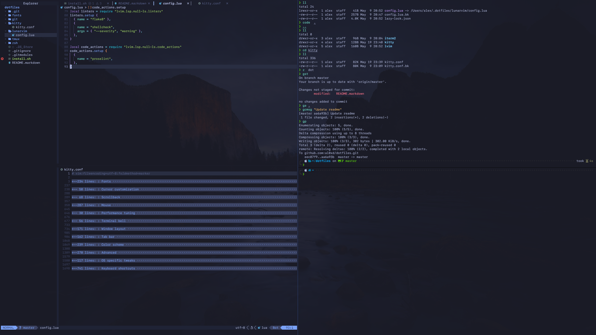

# ⚡ Dotfiles Configuration

> A minimalist and powerful dotfiles configuration tailored for web developers and productivity enthusiasts.

## 🎯 Overview

This repository contains a carefully curated collection of dotfiles and configurations that provide a seamless development environment. Designed with simplicity and productivity in mind, these configurations help you set up a powerful terminal-based workflow quickly.

## ✨ Features

- **Modern Terminal Setup**: Enhanced terminal experience with Kitty terminal emulator
- **Powerful Shell Configuration**: ZSH with Oh My Zsh and Powerlevel10k theme
- **Advanced Code Editor**: LunarVim configuration for efficient coding
- **Custom Fonts**: High-quality programming fonts included
- **Git Configuration**: Optimized Git settings and global gitignore
- **Automated Installation**: One-command setup process

## 📋 Prerequisites

Before installation, ensure you have the following dependencies installed:

| Tool | Description | Installation Link |
|------|-------------|-------------------|
| [Kitty](https://sw.kovidgoyal.net/kitty/) | Modern, feature-rich terminal emulator | [Install Guide](https://sw.kovidgoyal.net/kitty/binary/) |
| [Oh My Zsh](https://github.com/ohmyzsh/ohmyzsh) | Framework for managing Zsh configuration | [Install Guide](https://ohmyz.sh/#install) |
| [LunarVim](https://github.com/LunarVim/LunarVim) | IDE layer for Neovim with sane defaults | [Install Guide](https://www.lunarvim.org/docs/installation) |
| [Powerlevel10k](https://github.com/romkatv/powerlevel10k) | Fast and customizable Zsh theme | [Install Guide](https://github.com/romkatv/powerlevel10k#installation) |

## 🚀 Installation

### Quick Install (Recommended)

Open your terminal and run this single command:

```bash
bash <(curl -s https://raw.githubusercontent.com/al0xd/dotfiles/master/install.sh)
```

### Manual Installation

If you prefer to install manually or want more control over the process:

```bash
# Navigate to home directory
cd ~

# Clone the repository
git clone git@github.com:al0xd/dotfiles.git ~/.dotfiles

# Navigate to the dotfiles directory
cd ~/.dotfiles

# Make install script executable
chmod +x ./install.sh

# Run the installation script
./install.sh
```

## 🔄 Updating

To update your dotfiles configuration to the latest version:

```bash
# Navigate to dotfiles directory
cd ~/.dotfiles

# Pull latest changes
git pull origin master

# Re-run installation script to apply updates
./install.sh
```

## 📁 Project Structure

```
dotfiles/
├── fonts/           # Programming fonts collection
├── git/            # Git configuration files
├── kitty/          # Kitty terminal configuration
├── lunarvim/       # LunarVim configuration
├── zsh/            # ZSH configuration and aliases
├── install.sh      # Automated installation script
└── README.md       # This file
```

## ⚙️ What's Included

- **Kitty Configuration**: Optimized terminal settings with custom key bindings
- **ZSH Setup**: Enhanced shell with useful aliases and functions
- **Git Configuration**: Global settings and comprehensive gitignore
- **LunarVim Config**: IDE-like experience with essential plugins
- **Font Collection**: Programming-focused fonts for better readability

## 🤝 Contributing

Contributions are welcome! If you have suggestions for improvements or find any issues:

1. Fork the repository
2. Create a feature branch
3. Make your changes
4. Submit a pull request

## 📝 License

This project is open source and available under the [MIT License](LICENSE).

## 👨‍💻 Contributors

- **[Alex Dinh](https://github.com/al0xd)** - Creator and maintainer

---

<div align="center">
  <p>Made with ❤️ for the developer community</p>
  <p>⭐ Star this repo if it helped you!</p>
</div>
